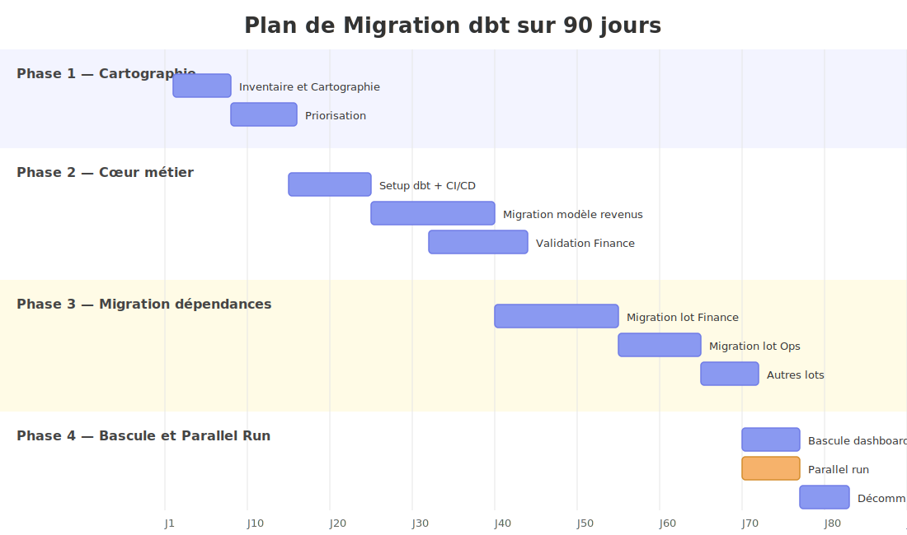
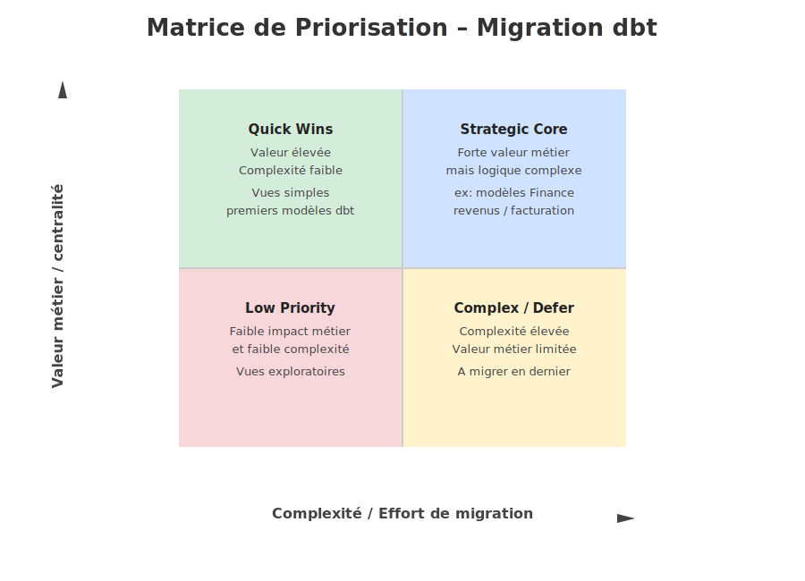
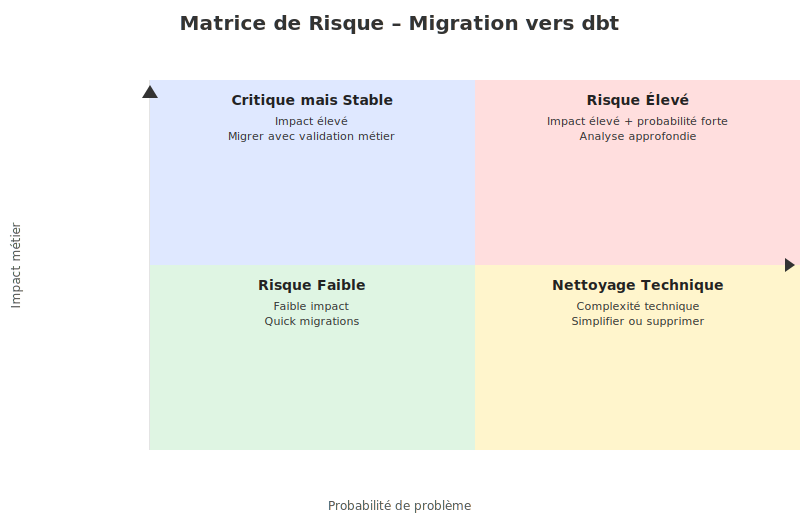
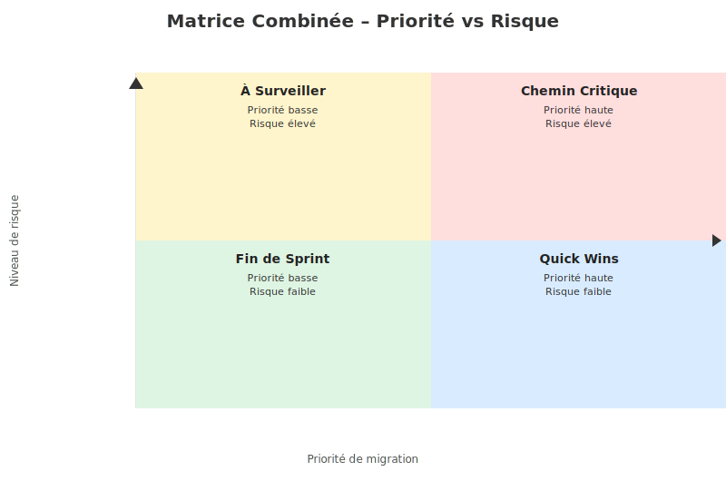
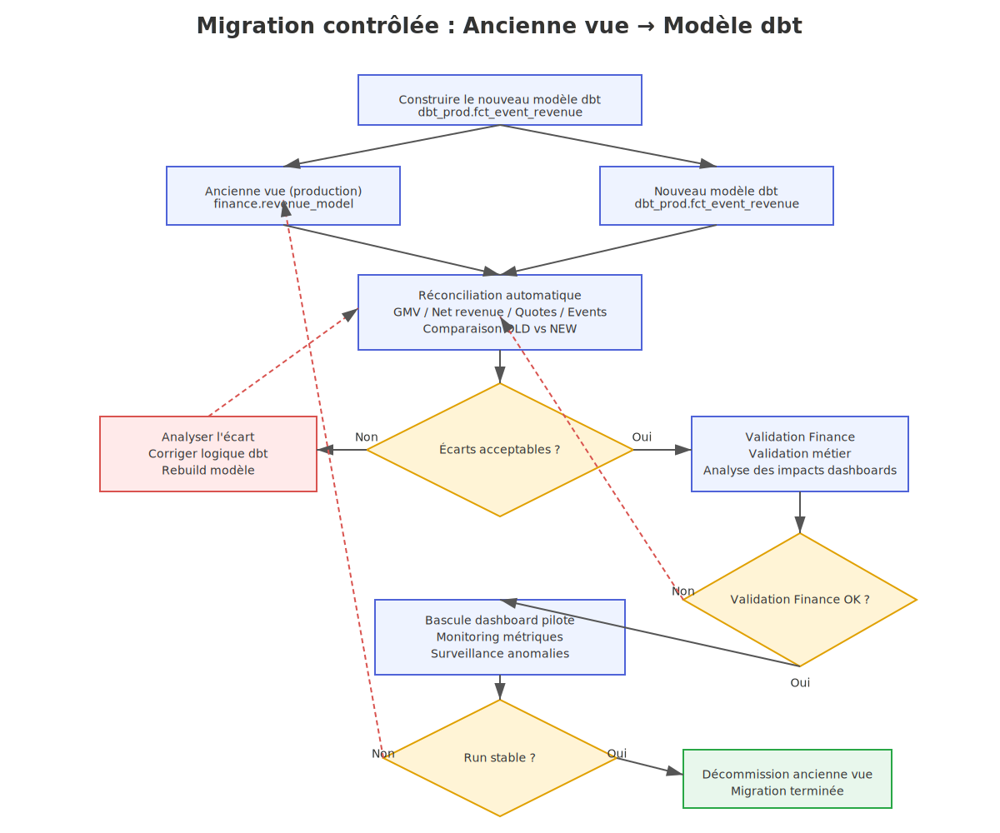

# Partie 4 — Migration progressive vers dbt

## 4.1 — Stratégie sur 90 jours

Avec 90 jours, mon objectif n’est pas de “réécrire tout BigQuery” d’un coup, mais de **reprendre le contrôle progressivement** :
1. rendre visible l’existant,
2. sécuriser les transformations critiques,
3. migrer par lots,
4. basculer la consommation sans casser la prod.

### Principe directeur

Je commencerais par les transformations qui ont le plus fort **risque métier** et le plus fort **effet de dépendance**, en particulier :
- le modèle de revenus,
- les vues utilisées par Finance,
- les objets réutilisés par plusieurs autres vues.

Je ne commencerais **pas** par refactoriser massivement tout le SQL existant, ni par renommer brutalement les objets déjà consommés en production.

---

### Phase 1 — Jours 1 à 15 : cartographier et stabiliser

Je commence par un **inventaire complet** des vues SQL manuelles existantes :
- quelles vues existent,
- dans quels datasets,
- qui les consomme,
- quelles vues dépendent de quelles autres,
- quelles sont les tables/vues critiques pour la production,
- quelles transformations embarquent des règles métier sensibles.

L’objectif de cette phase est de construire une **cartographie de dépendances** et une **priorisation**.

Je classerais ensuite les objets en 3 catégories :

#### A. Critiques
Objets :
- utilisés en production,
- consommés par Finance / reporting exécutif,
- ou servant de base à plusieurs autres transformations.

#### B. Importants mais non critiques
Objets :
- utiles pour l’analyse,
- mais sans impact immédiat si leur migration attend quelques semaines.

#### C. Faible priorité
Objets :
- peu utilisés,
- redondants,
- temporaires,
- ou recréables facilement.

Pendant cette phase, j’évite :
- les changements de logique métier non indispensables,
- les optimisations “cosmétiques”,
- les renommages cassants,
- la fusion de plusieurs chantiers en même temps.

---

### Phase 2 — Jours 15 à 45 : migrer d’abord le cœur métier

Je migre en premier les couches qui structurent le reste :

1. **sources dbt**
2. **staging**
3. **intermediate**
4. **modèle de revenus**
5. seulement ensuite les vues aval dépendantes

La bonne approche est de **reconstruire le noyau stable** avant de migrer les couches de consommation.

Je mets également en place dès cette phase les premiers mécanismes d’industrialisation :
- exécution dbt automatisée,
- premiers tests de qualité,
- pipeline CI/CD minimal pour sécuriser les changements.

Pour le modèle de revenus, je ferais une migration très encadrée :
- reproduction fidèle de la logique actuelle,
- tests de qualité,
- comparaison old vs new,
- validation métier avec Finance avant toute bascule.

L’objectif à ce stade n’est pas d’“améliorer” la logique métier, mais d’abord de la **rendre explicite, versionnée, testée et observable**.

---

### Phase 3 — Jours 45 à 75 : migrer les dépendances et industrialiser

Une fois le cœur stabilisé, je migre les vues dépendantes par **lots cohérents**, par exemple :
- lot Finance,
- lot Ops,
- lot analyses ad hoc,
- lot tables de support.

Pour chaque lot :
- je recrée la logique dans dbt,
- j’ajoute les tests de base,
- je documente le grain, les règles, les dépendances,
- je compare les résultats avec l’existant,
- je prépare les mécanismes de **comparaison old vs new** nécessaires au parallel run.

En parallèle, je mets en place :
- conventions de nommage,
- structure de projet dbt claire,
- tests automatiques,
- génération de documentation,
- pipeline CI/CD,
- stratégie de déploiement par environnement.

---

### Phase 4 — Jours 75 à 90 : bascule contrôlée et décommissionnement

La fin des 90 jours sert à :
- basculer progressivement les consommateurs,
- surveiller les écarts,
- décommissionner les anciennes vues devenues inutiles,
- formaliser les règles d’exploitation.

Je garde une période de coexistence contrôlée (**parallel run**) entre :
- les vues historiques,
- les modèles dbt équivalents.

Je ne supprime jamais une ancienne vue tant que :
- son remplaçant n’est pas validé,
- ses consommateurs ne sont pas identifiés,
- la surveillance post-bascule n’est pas satisfaisante.

---

---

### Ma logique de priorisation

Je priorise selon 4 critères :

#### 1. Impact métier
Une vue utilisée par Finance ou par un dashboard de production passe avant une vue exploratoire.

#### 2. Centralité dans les dépendances
Une vue réutilisée par 10 autres passe avant une vue terminale consommée seule.

#### 3. Risque de mauvaise qualité
Objets avec logique complexe, jointures fragiles, doublons possibles, règles implicites.

#### 4. Facilité de migration
Je garde aussi quelques “quick wins” pour installer rapidement de la valeur et montrer l’avancement.

---

#### Stratégie d'actions : 

* **Quick Wins (Valeur haute, Complexité basse)** : Migrer immédiatement pour générer rapidement de la valeur métier et démontrer l’avancement de la migration.

* **Projets Stratégiques (Valeur haute, Complexité haute)** : Planifier et sécuriser la migration avec analyse détaillée, refactoring progressif et validation métier.

* **Tâches de remplissage (Valeur basse, Complexité basse)** : Migrer opportunément lorsque du temps est disponible, sans en faire une priorité.

* **À reconsidérer / Déprioriser (Valeur basse, Complexité haute)** : Reporter ou supprimer si possible afin d’éviter d’investir du temps sur des objets à faible valeur.

## Matrice de Risque (Complément de la matrice de priorisation)

La matrice de priorisation permet d’identifier **ce qu’il faut migrer en premier pour générer de la valeur**.

Cependant, certaines vues peuvent présenter **un risque technique ou analytique élevé**, même si leur valeur métier n’est pas immédiatement visible.

Pour gérer cette dimension, j’utilise **une seconde matrice : la Matrice de Risque**.

Cette matrice permet d’identifier les objets qui nécessitent **une attention particulière avant migration**.

Les deux matrices répondent à deux questions différentes :

| Matrice                 | Question                                |
| ----------------------- | --------------------------------------- |
| Matrice de priorisation | Où créer rapidement de la valeur ?      |
| Matrice de risque       | Où se trouvent les dangers techniques ? |

### La Matrice Combinée : Priorité vs Risque

### Stratégie d’actions

**Priorité haute + risque élevé**
À traiter en priorité. Ces éléments ont un fort impact métier et comportent des incertitudes techniques qu’il faut lever rapidement (analyse, clarification des règles métier, ajout de tests).

**Priorité haute + risque faible**
Ils peuvent être migrés rapidement pour générer de la valeur et démontrer l’avancement de la migration.

**Priorité basse + risque élevé**
À **surveiller**. Ces objets peuvent être complexes mais leur impact métier est limité. Il vaut mieux éviter d’y investir trop de temps dans un premier temps.

**Priorité basse + risque faible**
À traiter **en fin de sprint ou en tâches de remplissage**, lorsque les éléments critiques et prioritaires ont déjà été migrés.

---

### Ce que j’éviterais au début

Au début, j’éviterais surtout 5 erreurs classiques :

#### 1. Réécrire toute la logique d’un seul coup
Trop risqué, peu lisible, difficile à valider.

#### 2. Mélanger migration et redesign métier
D’abord reproduire et fiabiliser. Le redesign vient après.

#### 3. Basculer sans comparaison old vs new
Impossible de sécuriser la transition sans validation chiffrée.

#### 4. Toucher immédiatement aux dashboards de prod
Il faut d’abord stabiliser la donnée en amont.

#### 5. Décommissionner trop tôt
Une vue manuelle non versionnée peut quand même être critique parce qu’elle alimente un usage caché.

---

## 4.2 — Semaine 1, lundi matin : mes 5 premières actions concrètes

### 1. Faire l’inventaire des vues et dépendances BigQuery
Je liste toutes les vues/tables SQL manuelles concernées :
- nom de l’objet,
- dataset,
- SQL associé,
- upstream,
- downstream,
- fréquence d’usage si identifiable,
- équipe consommatrice.

Livrable attendu : une première cartographie des dépendances.

---

### 2. Identifier les objets critiques métier
Je construis une matrice simple :
- critique / non critique,
- production / non production,
- Finance / non Finance,
- source de vérité / simple vue de consommation.

Le modèle de revenus et tout ce qui l’utilise directement remontent immédiatement en haut de la pile.

Livrable attendu : backlog priorisé de migration.

---

### 3. Geler le périmètre logique du modèle de revenus actuel
Avant de migrer, je capture précisément :
- la requête actuelle,
- les hypothèses métier,
- les colonnes produites,
- le grain,
- les règles de calcul,
- les consommateurs connus.

Je veux éviter qu’en pleine migration la définition métier change sans contrôle.

Livrable attendu : spécification fonctionnelle minimale du modèle actuel.

---

### 4. Reproduire dans dbt le squelette du pipeline amont
Je mets en place immédiatement dans dbt :
- les `sources`,
- les modèles de staging,
- les premiers tests de base,
- la documentation minimale,
- les conventions de nommage.

But : avoir un socle propre avant d’attaquer la migration des vues critiques.

Livrable attendu : premier DAG dbt exécutable sur les sources existantes.

---

### 5. Mettre en place un mécanisme de comparaison old vs new
Dès la première semaine, je prépare les requêtes de validation entre :
- ancienne vue manuelle,
- nouveau modèle dbt.

Je compare au minimum :
- nombre de lignes,
- grain,
- sommes de métriques clés,
- couverture des IDs,
- écarts ligne à ligne sur un échantillon.

Livrable attendu : framework de réconciliation réutilisable pour toute la migration.

---

## 4.3 — Coexistence ancienne vue / nouveau modèle dbt pendant la transition

Comme le modèle de revenus alimente des tableaux Finance en production, je mettrais en place une **transition en parallèle**, jamais une substitution brutale.

### Principe
Pendant une période définie, les deux versions coexistent :

- **ancienne vue** = version actuellement utilisée en production
- **nouveau modèle dbt** = version candidate, reconstruite et testée

L’idée est de faire tourner les deux en parallèle jusqu’à obtenir une confiance suffisante.

---

### Étape 1 — Construire le nouveau modèle sans casser l’ancien
Le nouveau modèle dbt est publié sous un nom distinct, par exemple :
- ancien : `finance.revenue_model`
- nouveau : `dbt_prod.fct_event_revenue`

Ainsi, aucun dashboard existant n’est impacté au moment de la construction.

---

### Étape 2 — Réconcilier systématiquement les deux versions
Je mets en place des comparaisons automatiques entre old et new :
- total GMV,
- total net revenue,
- nombre d’événements,
- nombre de propositions / quotes,
- répartition par étape de paiement,
- écarts sur des périodes de contrôle.

Je définis aussi des seuils :
- écart attendu = 0 sur certaines métriques,
- ou écart tolérable documenté si la logique a été volontairement corrigée.

---

### Étape 3 — Faire valider la version dbt par Finance
Avant toute bascule, je présente à Finance :
- les règles de calcul,
- les écarts éventuels,
- les cas corrigés,
- les impacts attendus sur les tableaux.

La bascule ne doit pas être seulement technique ; elle doit être **métierement approuvée**.

---

### Étape 4 — Introduire une couche de compatibilité
Pour réduire le risque, je peux utiliser une vue de compatibilité :

- soit une vue finale qui pointe encore vers l’ancien objet,
- puis qu’on redirige ensuite vers le modèle dbt,
- soit un alias / contrat de sortie conservant exactement les mêmes colonnes que l’existant.

Autrement dit, on stabilise l’interface consommée par les dashboards, même si l’implémentation en dessous change.

---

### Étape 5 — Basculer progressivement les consommateurs
Je basculerais idéalement en plusieurs temps :
1. validation technique,
2. validation Finance,
3. bascule d’un dashboard pilote,
4. surveillance,
5. bascule du reste.

Cela permet de réduire l’impact potentiel en cas d’écart inattendu.

---

### Étape 6 — Décommissionner seulement après stabilisation
L’ancienne vue ne sera supprimée qu’après :
- plusieurs runs stables,
- absence d’écarts non expliqués,
- validation des utilisateurs,
- confirmation qu’aucun dashboard caché ne dépend encore de l’ancien objet.

---

---
### Résumé de l’approche de coexistence

La bonne transition n’est pas :
- “on remplace l’ancienne vue par la nouvelle et on espère”.

La bonne transition est :
- **parallel run**,
- **réconciliation chiffrée**,
- **validation métier**,
- **bascule contrôlée**,
- **décommissionnement tardif**.

C’est la manière la plus sûre de migrer un modèle sensible déjà utilisé par Finance en production.

